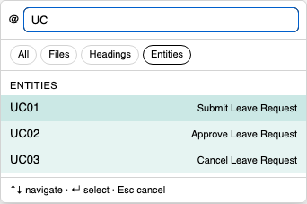
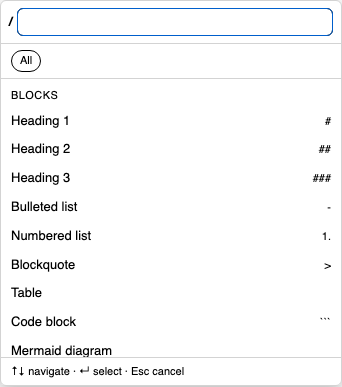

# Orca MD Editor

A fast, clean WYSIWYG editor for `.md` files: **preview Markdown with pixel-accurate rendering while editing directly in the preview**, drag-and-drop to reorder blocks/tables/lists, search across your whole project, and use a rich toolbar — all while every change syncs back to the `.md` file pristine and diff-friendly.

## What's New in 0.9.0

Three headline additions this release — a keyboard-driven trigger system, a cross-document entity model, and a redesigned Reading Mode.

### `@` Mention & `/` Commands

Type a trigger character and pick without leaving the keyboard — a real focused input with native caret + IME, so the marker stays inline and only the picked result is written back.

- **`@`** — mention a declared entity; the link shows its full name (`UC01 Submit Leave Request`) while the URL fragment stays clean (`#UC01`).
- **`/`** — a block menu (Heading 1–3, lists, table, code, Mermaid…) and commands from the line start.

| `@` Mention | `/` Commands |
| --- | --- |
|  |  |

### Entity Declare & Reference

Turn any block into a navigable, searchable entity with a `caption::NS_ID` declaration — indexed automatically to power `@`-mention search.

- **Cmd/Ctrl-click** a mention to open the target file *and* jump to its declaration (the badge flashes).
- **Hover** shows the entity name plus a short preview of the following text.
- **Broken references** get a warning marker; its fix popup re-points the link at the correct file.

| Declaration badge | Mention pill |
| --- | --- |
|  |  |

### Reading Mode — 3 themes

Read your document in **Standard**, **Sepia**, or **Paper** — each a self-contained color set, chosen from a dropdown with swatches. Trigger popups, TOC rail, and toolbar all restyle to match.

| Standard | Sepia | Paper |
| --- | --- | --- |
|  |  |  |

## Features

-   **Edit Markdown like a document, not raw text**: type straight into the rendered preview with real formatting (headings, bold/italic, lists, quotes, tables...), keyboard shortcuts, and Notion/Typora-style auto-formatting (`#`, `-`, `1.`, `>` convert as you type) — no need to memorize Markdown syntax, and task-list checkboxes are clickable.
-   **Visual table editing**: add/remove/align rows and columns and manage headers from a floating toolbar — no hand-written pipe syntax.
-   **`@` mention & `/` commands**: insert links, cross-project entity references, or any block (heading, table, code, math, diagram...) without leaving the keyboard; broken references are flagged with a one-click fix.
-   **Cross-linked entities**: tag any heading or paragraph as a named entity (e.g. a requirement or use case) and reference it from anywhere in the project — turns scattered docs into a navigable knowledge base.
-   **Fully compatible rendering**: same CommonMark + GFM engine as VS Code's built-in Preview (headings, tables, code blocks, math, Mermaid & PlantUML diagrams...), so nothing looks different when switching editors.
-   **In-file & cross-project search**: find and jump to any match, in the open file or across the whole workspace.
-   **Table of Contents & navigation**: auto-generated outline with reading-progress stats, plus a line-number gutter mapped to the real file.
-   **Reading Mode**: Standard, Sepia, or Paper themes for comfortable long-form reading, with a distraction-free Focus mode.
-   **Bring docs into AI chat**: one-click copy of an `@file` reference for Claude Code and other AI assistants that understand `@file` mentions.
