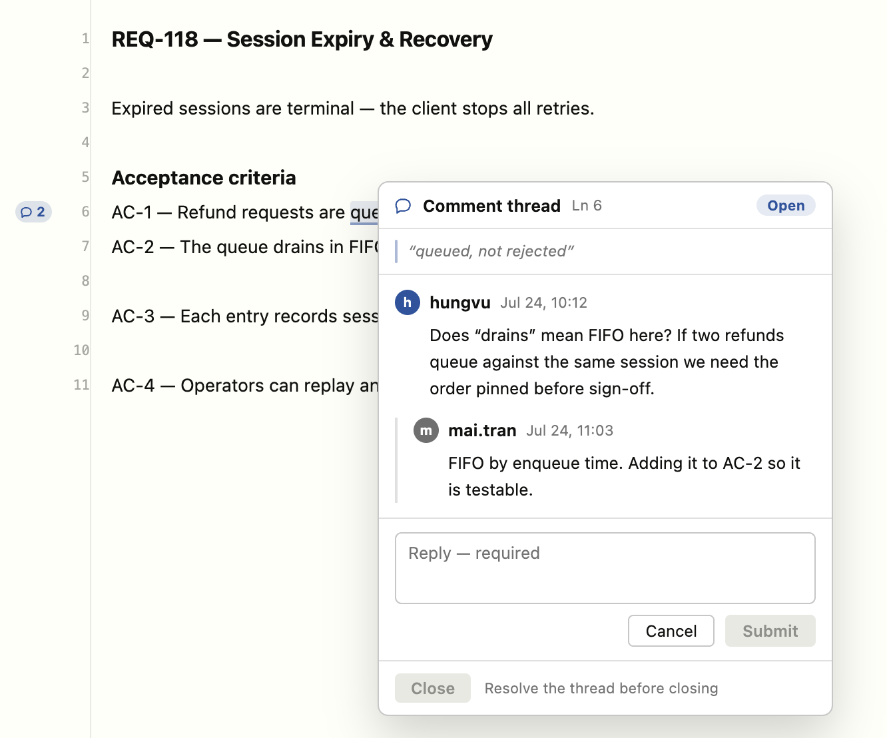
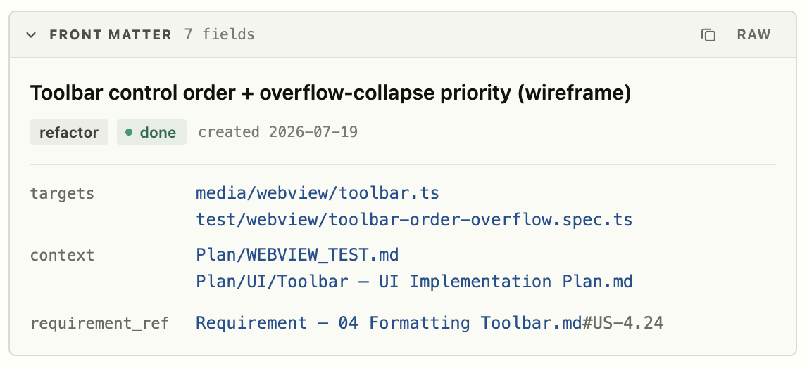
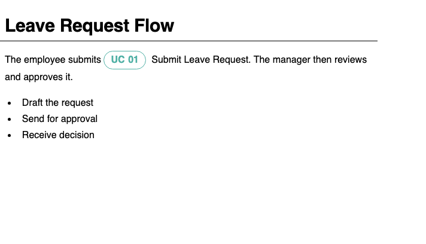
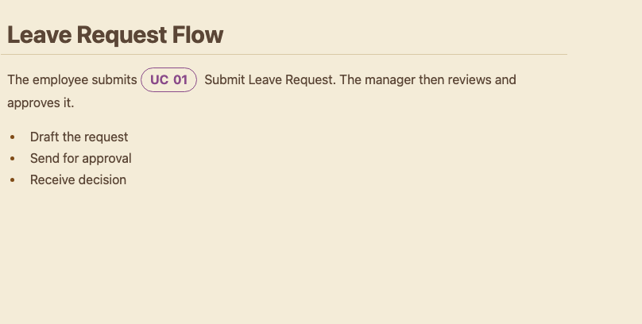
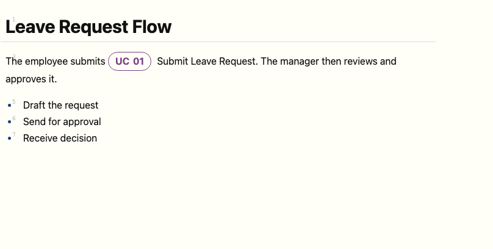

# Orca MD Editor

A fast, clean WYSIWYG editor for `.md` files: **preview Markdown with pixel-accurate rendering while editing directly in the preview**, drag-and-drop to reorder blocks/tables/lists, search across your whole project, and use a rich toolbar — all while every change syncs back to the `.md` file pristine and diff-friendly.

## What's New in 1.1.0

Two headline additions this release — threaded review comments and expanded front matter support (YAML, TOML, JSON).

### Review Comments

Leave threaded comments anchored to any line, right in the WYSIWYG editor — reply, resolve, reopen, or close without leaving the document.

- **Anchored to source lines**: a gutter pin marks each thread; click the highlighted text or the pin to open it.
- **Full lifecycle**: reply, resolve, reopen, and close, with author and timestamp tracked per comment.
- **Portable**: comments live in a sidecar file next to the `.md`, so the document itself stays clean.

### Front Matter — YAML, TOML & JSON

Front matter now renders as a structured, collapsible card instead of raw text, parsed by a real parser so nested maps, lists, and block scalars display correctly.

- **YAML** (`---`), **TOML** (`+++`), and **JSON** (`{...}`) front matter all render as the same card.
- Collapse/expand to save space, or toggle **Raw** to see the exact source.
- Round-trips byte-for-byte on save — no reformatting of your fences.

### Reading Mode — 3 themes

Read your document in **Standard**, **Sepia**, or **Paper** — each a self-contained color set, chosen from a dropdown with swatches. Trigger popups, TOC rail, and toolbar all restyle to match.

| Standard | Sepia | Paper |
| --- | --- | --- |
|  |  |  |

## Features

-   **Edit Markdown like a document, not raw text**: type straight into the rendered preview with real formatting (headings, bold/italic, lists, quotes, tables...), keyboard shortcuts, and Notion/Typora-style auto-formatting (`#`, `-`, `1.`, `>` convert as you type) — no need to memorize Markdown syntax, and task-list checkboxes are clickable.
-   **Visual table editing**: add/remove/align rows and columns and manage headers from a floating toolbar — no hand-written pipe syntax.
-   **`@` mention & `/` commands**: insert links, cross-project entity references, or any block (heading, table, code, math, diagram...) without leaving the keyboard; broken references are flagged with a one-click fix.
-   **Cross-linked entities**: tag any heading or paragraph as a named entity (e.g. a requirement or use case) and reference it from anywhere in the project — turns scattered docs into a navigable knowledge base.
-   **Fully compatible rendering**: same CommonMark + GFM engine as VS Code's built-in Preview (headings, tables, code blocks, math, Mermaid & PlantUML diagrams...), so nothing looks different when switching editors.
-   **In-file & cross-project search**: find and jump to any match, in the open file or across the whole workspace.
-   **Table of Contents & navigation**: auto-generated outline with reading-progress stats, plus a line-number gutter mapped to the real file.
-   **Reading Mode**: Standard, Sepia, or Paper themes for comfortable long-form reading, with a distraction-free Focus mode.
-   **Bring docs into AI chat**: one-click copy of an `@file` reference for Claude Code and other AI assistants that understand `@file` mentions.
