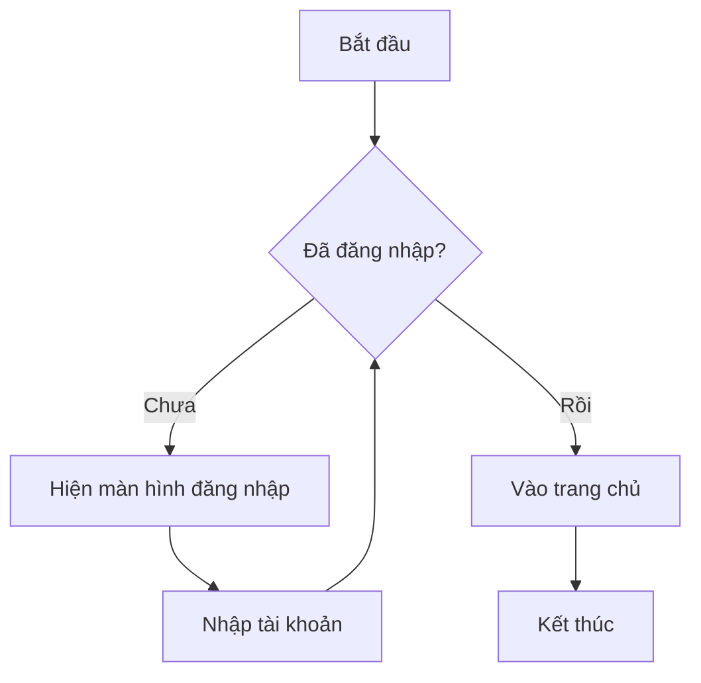
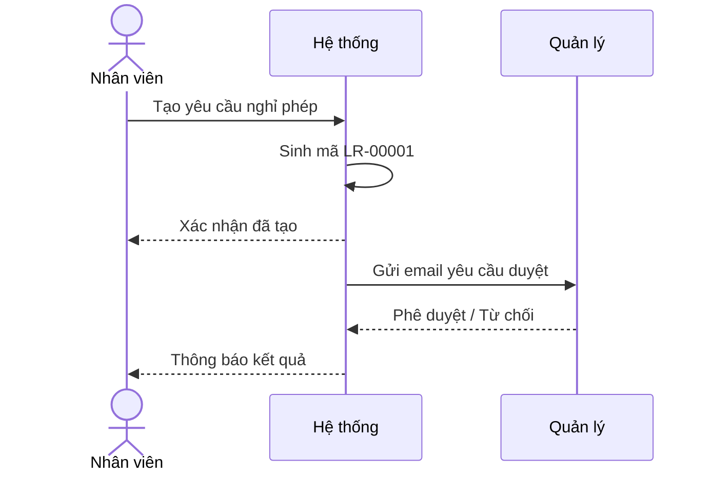
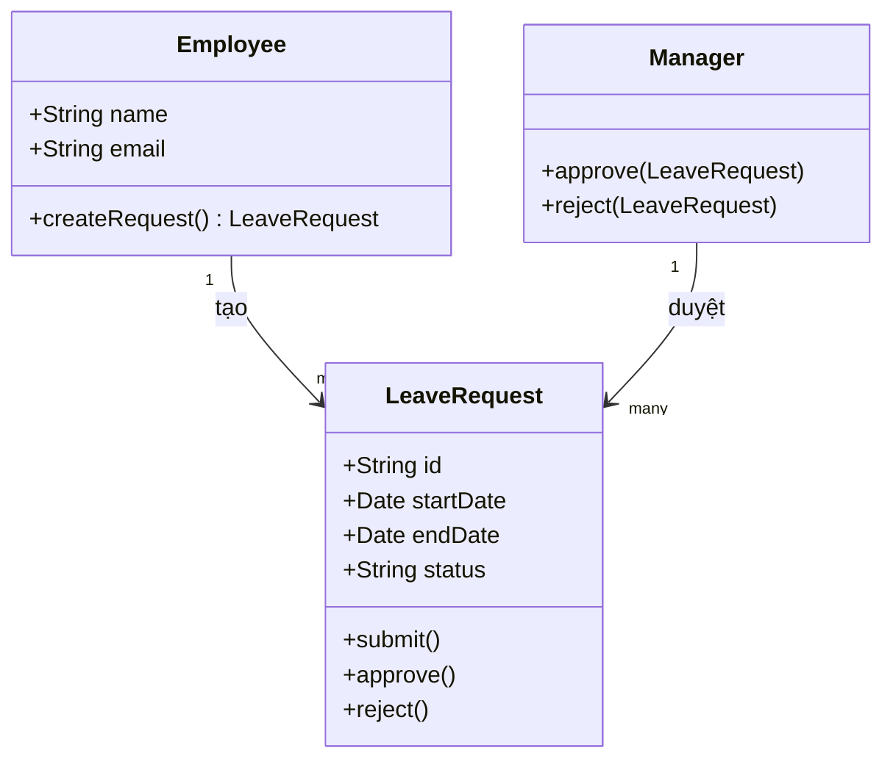
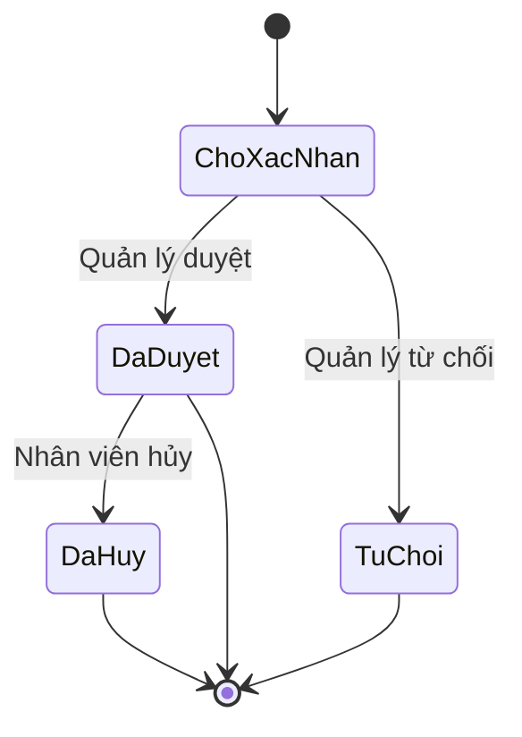
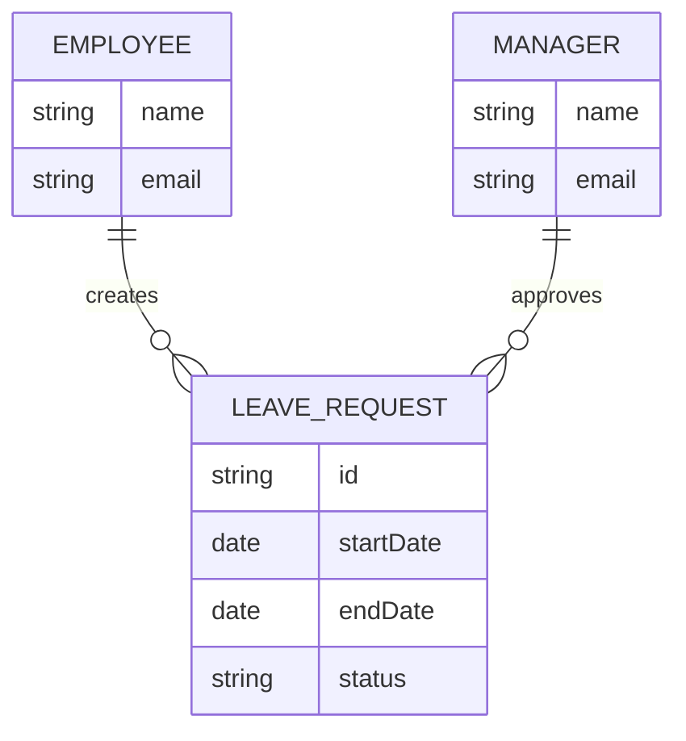
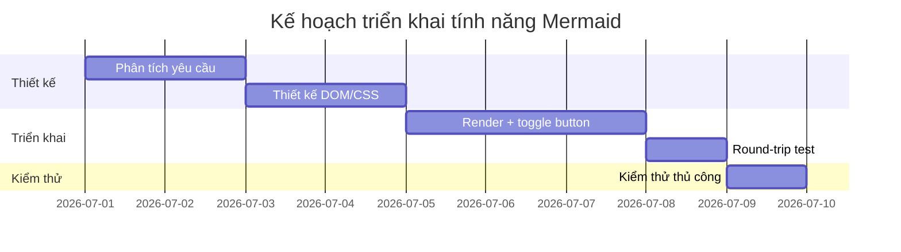
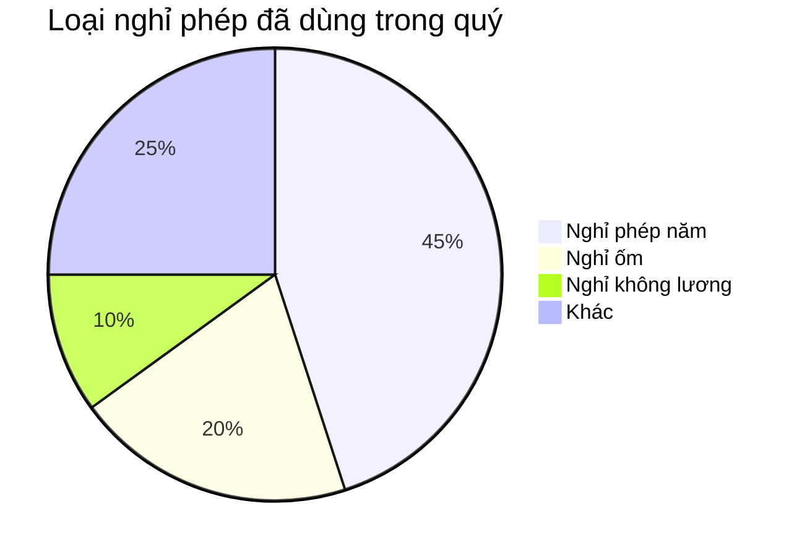

# Mermaid Sample

File này để thử tính năng hiển thị biểu đồ Mermaid trong WYSIWYG Preview. Mỗi khối bên dưới mặc định hiện **biểu đồ**; bấm nút **"Xem mã nguồn"** ở góc trên phải để chuyển sang xem/sửa mã `mermaid` gốc, bấm lại để quay về biểu đồ.

## 1\. Flowchart



## 2\. Sequence Diagram



## 3\. Class Diagram



## 4\. State Diagram



## 5\. Entity Relationship Diagram



## 6\. Gantt Chart



## 7\. Pie Chart



## 8\. Mã lỗi (kiểm tra fallback)

Khối dưới đây cố tình sai cú pháp — khi bấm sang xem biểu đồ sẽ tự động quay lại xem mã kèm thông báo lỗi thay vì hiển thị màn hình trắng.

```mermaid
flowchart TD
    A --> [đây không phải cú pháp Mermoid hợp lệ
```
