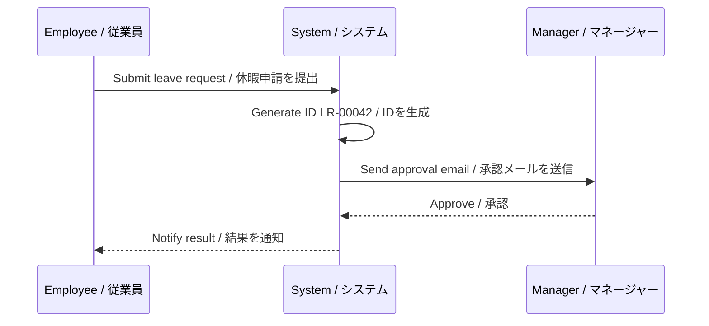
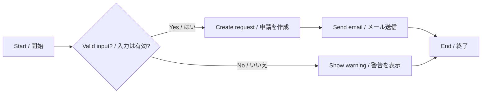

# Bilingual Sample / バイリンガルサンプル

This file contains every supported Markdown format in **English** and **Japanese (日本語)** for preview testing.
このファイルはプレビューのテスト用に、すべての対応 Markdown 形式を**英語**と**日本語**で記載しています。

## 1. Headings / 見出し

### 1.1. Level 3 Heading / レベル3見出し

#### 1.1.1. Level 4 Heading / レベル4見出し

##### Level 5 Heading / レベル5見出し

###### Level 6 Heading / レベル6見出し

## 2. Text Styles / テキストスタイル

- **Bold** — **太字のテキスト**
- *Italic* — *斜体のテキスト*
- ***Bold Italic*** — ***太字斜体***
- ~~Strikethrough~~ — ~~取り消し線~~
- `Inline code` — `インラインコード`
- Combination: **The `deadline` is *tomorrow*** — **`締め切り`は*明日*です**

## 3. Lists / リスト

### 3.1. Unordered List / 箇条書きリスト

- Employee submits a leave request / 従業員が休暇申請を提出する
- Manager reviews the request / マネージャーが申請を確認する
    - Approve / 承認する
    - Reject with a reason / 理由を付けて却下する
- System sends a notification email / システムが通知メールを送信する

### 3.2. Ordered List / 番号付きリスト

1. Open the application / アプリケーションを開く
2. Fill in the request form / 申請フォームに入力する
    1. Select leave type / 休暇の種類を選択する
    2. Enter start and end date / 開始日と終了日を入力する
3. Click **Submit** / **送信**ボタンをクリックする

### 3.3. Task List / タスクリスト

- [x] User has logged in / ユーザーがログイン済みである
- [x] User has permission to create requests / ユーザーに申請作成の権限がある
- [ ] Manager email is configured / マネージャーのメールアドレスが設定されている
- [ ] Notification service is running / 通知サービスが稼働している

## 4. Table / テーブル

| # | Step / ステップ | Actor / 実行者 | Description / 説明 |
| :-: | --- | --- | --- |
| 1 | Select function / 機能を選択 | Employee / 従業員 | Choose "Create Leave Request" on the menu screen.<br>メニュー画面で「休暇申請の作成」を選択します。 |
| 2 | Enter information / 情報を入力 | Employee / 従業員 | Enter leave type, reason, start/end date.<br>休暇の種類、理由、開始日・終了日を入力します。 |
| 3 | Create request / 申請を作成 | System / システム | - Generate request ID `LR-<5 digits>`.<br>- 申請ID `LR-<5桁>` を自動生成します。<br>- Write an audit log.<br>- 監査ログを記録します。 |
| 4 | Send email / メールを送信 | System / システム | Notify the Project Manager for approval.<br>承認のためプロジェクトマネージャーに通知します。 |

## 5. Code Blocks / コードブロック

```javascript
// Generate a request ID / 申請IDを生成する
function generateRequestId(sequence) {
  return `LR-${String(sequence).padStart(5, "0")}`;
}

console.log(generateRequestId(42)); // "LR-00042"
```

```python
# Calculate remaining leave days / 残りの休暇日数を計算する
def remaining_days(total: int, used: int) -> int:
    """Return remaining leave days. 残日数を返します。"""
    return total - used

print(remaining_days(12, 5))  # 7
```

```json
{
  "requestId": "LR-00042",
  "status": "pending",
  "reason_en": "Family vacation",
  "reason_ja": "家族旅行"
}
```

## 6. Blockquote / 引用

> **Note:** The initial status of a request is *Pending Approval*.
>
> **注意:** 申請の初期ステータスは*承認待ち*です。

> Nested quote / ネストされた引用:
> > "Quality is not an act, it is a habit." — Aristotle
> > 「品質とは行為ではなく、習慣である。」 — アリストテレス

## 7. Math / 数式

Remaining leave formula / 残休暇の計算式: $R = T - U$ where $T$ is the total quota and $U$ is the used days.
ここで $T$ は総日数、$U$ は使用済み日数です。

Overtime pay / 残業代: $P = h \times r \times 1.25$

## 8. Links & Images / リンクと画像

- External link / 外部リンク: [Business documentation / 業務ドキュメント](https://example.com/docs)
- Email / メール: admin@example.com
- Image / 画像:


## 9. Horizontal Rule / 水平線

Content above the line. / 線の上のコンテンツ。

---

Content below the line. / 線の下のコンテンツ。

## 10. Mermaid Diagram / Mermaid 図





## 11. Mixed Long Text / 長文の混在テスト

When an employee submits a leave request, the system automatically generates a unique identifier, records an audit log entry, and updates the request status to *Pending Approval*. If required fields are missing, the system displays a warning and stops the workflow.

従業員が休暇申請を提出すると、システムは自動的に一意の識別子を生成し、監査ログを記録し、申請ステータスを*承認待ち*に更新します。必須項目が入力されていない場合、システムは警告を表示し、処理を中断します。

半角カナテスト: ﾃｽﾄﾃﾞｰﾀ / Full-width test: ＡＢＣ１２３ / Kanji + Kana + Romaji: 休暇申請システム（きゅうかしんせいシステム / Kyūka Shinsei System）
