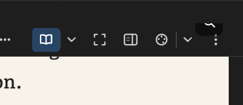
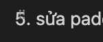
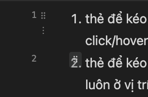

# Bug 0715

| # | Status | Bug | Root Cause | Solution |
| --- | --- | --- | --- | --- |
| 1 |  | Drag handle hides immediately when the cursor leaves the block, before the user can click it. Should only hide when hovering a different block. | [`drag-drop.ts:338-360`](../media/webview/drag-drop.ts#L338-L360) (old): the `mouseleave` handler cleared hover state unconditionally. The handle is appended to `document.body` (offset left of `#content`), so moving the cursor from the block onto the handle itself also fires `#content`'s `mouseleave`. | **\[DONE, uncommitted\]** Guard added: check `e.relatedTarget` against `handleEl`/`menuBtnEl`/`liHandleEl` before clearing hover state — only clears when leaving toward something unrelated to the handles. |
| 2 | Done | TOC doesn't show the full heading text when highlighted — currently wraps to 2 lines instead of truncating with a tooltip. Panel should be resizable, and widening it should reveal more text. | [`toc.ts:154`](../media/webview/toc.ts#L154) has no `title` attribute (removed in an uncommitted regression fix aimed at a different symptom); [`editor.css:1321-1332`](../media/editor.css#L1321-L1332) currently forces `white-space: normal` on **every** `.toc-item`, so all rows wrap instead of truncating. | **\[DONE\]** Reverted `.toc-item` to `overflow: hidden; text-overflow: ellipsis; white-space: nowrap;` and removed the `:hover`/`.active` wrap override in `editor.css`; restored `link.title = text;` in `toc.ts:154` for the native tooltip. Resize panel was already fully implemented ([`toc.ts:41-111`](../media/webview/toc.ts#L41-L111), `--toc-width` var) — confirmed truncation tracks the resized width automatically, no changes needed there. Verified: `.toc-item` width is bound by `#toc-panel { width: var(--toc-width) }` with no competing `max-width`; no other CSS/TS sets conflicting `white-space`/`overflow`/`title` on TOC items. |
| 3 | Done | Pasted image size no longer always fills document width, but is still bigger than the original screenshot — likely wrong clipboard image size detection. | Confirmed via live test on a single-display MacBook Pro (Retina, `backingScaleFactor=2`, no VS Code zoom override — multi-monitor DPR mismatch ruled out): the raw markdown for a pasted image had **no `width` attribute at all** (``). Root cause: `measureWidth()` built a `blob:` URL via `URL.createObjectURL()` to probe the image, but the webview's CSP `img-src` only allows `${webview.cspSource}` and `data:` — no `blob:` ([`provider.ts:1222-1226`](../src/provider.ts#L1222-L1226)). Every `probe.decode()` call was silently blocked by CSP and rejected, so `measureWidth` always fell back to `undefined`. The image then rendered at full physical-pixel size (2x on Retina) with no width correction at all — not an occasional race, every single paste. | **\[DONE\]** Rewrote `measureWidth` to probe a `data:` URL (already CSP-allowed) instead of a `blob:` URL — reused the same `FileReader.readAsDataURL()` result already used for the host save round-trip instead of a separate blob URL ([`paste-image.ts:60-116`](../media/webview/paste-image.ts#L60-L116)). No CSP change needed (kept the existing hardened `img-src`). Verified: `npm run typecheck` clean, `npm run test:roundtrip:paste-image` 3/3 pass, rebuilt via `npm run compile`. Needs a fresh F5 test to confirm the fix on a real paste. |
| 4 |  | Opening a new file causes a visual jump — toolbar appears then disappears. Default should be "not focused" (Focus Mode off) when opening a tab. | [`editor.css:1729-1739`](../media/editor.css#L1729-L1739) (old) toggled `padding-top` with a transition every time Focus Mode's toolbar reveal/hide state changed, causing layout jump. | **\[DONE, uncommitted\]** `padding-top` is now reserved unconditionally as soon as Zen mode is entered, independent of reveal state — no more animated jump. **\[TODO — separate residual cause\]** `recalcOverflow()` ([`toolbar.ts:996-1030`](../media/webview/toolbar.ts#L996-L1030)) runs on first mount via `ResizeObserver` and can render all toolbar buttons wide before collapsing extras into the "…" menu — re-verify if jump persists after the Zen fix; if so, this is the next thing to address.  |
| 5 |  | Reading mode / focus / palette defaults are set incorrectly. Fresh install should default to reading mode = comfortable, focus = false, palette = follow VS Code. | `readingMode` default is already `comfortable` ([`package.json:158`](../package.json#L158)) and `focus` default is already `false` ([`package.json:182`](../package.json#L182)) — not actually broken. Only `palette` default is wrong: [`package.json:172`](../package.json#L172) is `"sepia"` instead of `"followTheme"`. | **\[TODO\]** Change `package.json:172` default to `"followTheme"`, plus matching fallbacks: [`provider.ts:205`](../src/provider.ts#L205), [`provider.ts:1300`](../src/provider.ts#L1300), [`provider.ts:1304`](../src/provider.ts#L1304), [`readability.ts:118`](../media/webview/readability.ts#L118), and the "Default" badge logic at [`toolbar.ts:399`](../media/webview/toolbar.ts#L399). |
| 6 |  | Image popup button gets overlapped by the toolbar.  | [`image-zoom.ts:56-68`](../media/webview/image-zoom.ts#L56-L68) `positionBtn()` positions the zoom button using the image's raw `getBoundingClientRect()` with no clamp against the sticky toolbar's height — unlike the equivalent pattern already used for the table toolbar ([`table.ts:206-225`](../media/webview/table.ts#L206-L225)). For images near the top of the document, the button lands inside the toolbar's band. | **\[TODO\]** Apply the same clamp pattern used in `table.ts:206-225` (`Math.max(top, toolbarEl.bottom + gap)`) to `image-zoom.ts`'s `positionBtn()`. |
| 7 |  | Bullet/ordered-list drag handle overlaps the marker/number; should be shifted further left.  | `positionLiHandle()` ([`drag-drop.ts:310-319`](../media/webview/drag-drop.ts#L310-L319)) places the handle at a fixed `li.left - 20px`. Lists have no custom marker padding ([`markdown.css:76-79`](../media/markdown.css#L76-L79)), so the browser's default marker renders in that same band — multi-digit ordered numbers ("10.", "100.") are wider than the assumed 20px and collide with the handle. | **\[TODO\]** Increase the fixed offset (e.g. -20px → -28/-32px) to leave enough clearance for wider markers. |
| 8 |  | Multiple drag handles show at once due to nested list items; the two outer handles can't be reached because they hide before the cursor arrives.  | The "hides too fast" part shares the root cause of Bug #1 (now fixed). The remaining structural issue: `findLiAt` ([`drag-drop.ts:304-308`](../media/webview/drag-drop.ts#L304-L308)) always resolves to the **innermost** `<li>` via `closest('li')`, so an ancestor `<li>` that itself contains a nested sub-list has no way to surface its own handle while the cursor is anywhere inside its nested subtree — only the top-level block handle and the innermost item's handle are ever reachable. | **\[TODO — needs design\]** Requires reworking hit-testing in `findLiAt` (e.g. prefer an ancestor `<li>` when the cursor's x-position aligns with that ancestor's own indent level rather than always picking the innermost via `elementFromPoint`). Not a one-line fix — scope with a UX decision first. |
| 9 |  | Table row/column drag handles also hide/show too fast to click. | [`table.ts:1015-1023`](../media/webview/table.ts#L1015-L1023) `mouseleave` handler takes no event parameter and has no `relatedTarget` check at all — the same bug pattern as Bug #1, but the fix applied to `drag-drop.ts` was never mirrored here (the uncommitted table.ts changes only added scroll-reposition, not this guard). | **\[TODO\]** Apply the same `relatedTarget` guard pattern from `drag-drop.ts:338-360` to `table.ts`'s `mouseleave` handler (check against `rowHandleEl`/`colHandleEl`). |
| 10 |  | TOC drag & drop reordering not implemented yet. | N/A — feature already exists. | **\[NOT A BUG\]** TOC drag reorder is fully implemented ([`toc.ts:41-345`](../media/webview/toc.ts#L41-L345), US-17.7 M5, already committed). Likely a stale report from before this shipped — please re-verify and provide repro steps if it still reproduces. |
| 11 |  | Should always show only 1 handle at the lowest level under the cursor; for tables, should show 2 handles (row + column) for the hovered cell. | Two independent modules run uncoordinated on the same `#content mousemove`: `<table>` still counts as a top-level draggable block ([`drag-drop.ts:89-91`](../media/webview/drag-drop.ts#L89-L91)), so hovering a table cell always also shows the whole-table block handle; meanwhile `table.ts:992-1013` makes row and column handles **mutually exclusive** (never shown together). Net effect: shows the wrong pair (block+row or block+col) instead of the right pair (row+col). | **\[TODO\]** Exclude `<table>` from `draggableTopLevelBlocks()` in `drag-drop.ts`, and change `table.ts`'s mousemove handler to compute row and column independently so both can show simultaneously. |
| 12 |  | The hover-highlight border around a block should move together with the handle, anchored at its top-left corner. | No such highlight/outline feature exists anywhere in the codebase today — confirmed no `outline`/`border`/class toggle tied to `hoveredBlock`/`hoveredLi`/`hoveredRow` in `drag-drop.ts`, `table.ts`, or `editor.css`. | **\[TODO — new feature\]** Add a highlight class/element toggled in the same functions that already drive handle positioning (`positionHandle`/`positionLiHandle` in `drag-drop.ts`, `positionRowHandle`/`positionColHandle` in `table.ts`), so it stays in sync with the existing `hoveredBlock`/`hoveredLi`/`hoveredRow`/`hoveredCol` state. |
